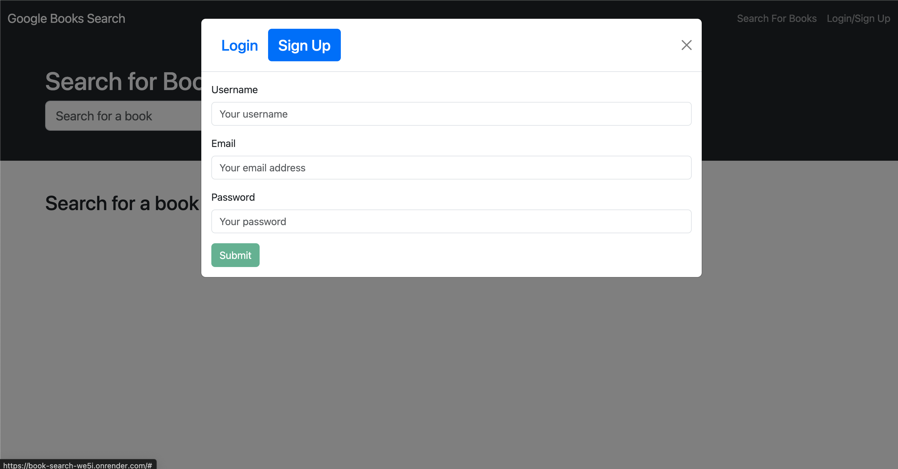
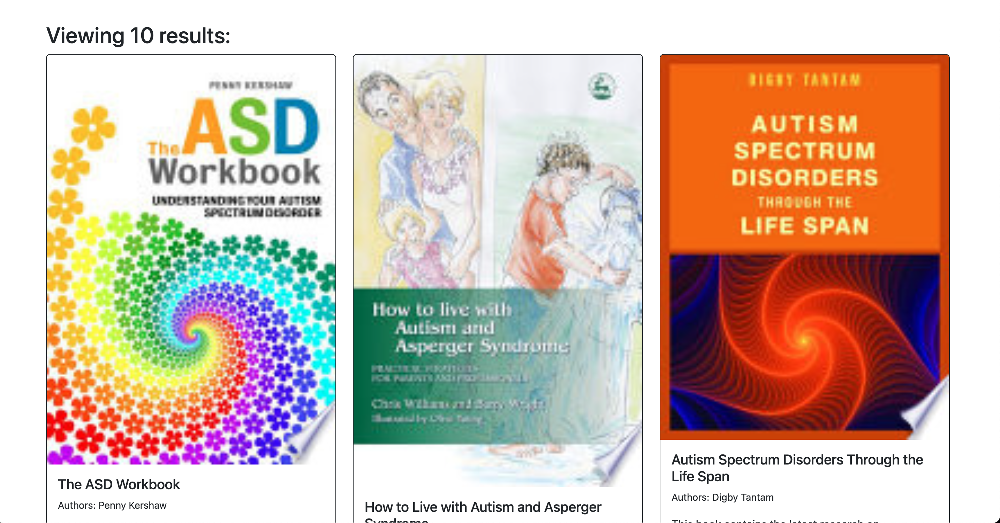

### Google Books Search App

## Description
The Google Books Search App allows users to search for books using the Google Books API. Users can create an account, log in, and save their favorite books to a personal list. This app demonstrates the use of a full-stack MERN (MongoDB, Express.js, React, Node.js) architecture with GraphQL for API queries and mutations.

## Table of Contents
- [Installation](#installation)
- [Technologies Used](#technologies-used)
- [Deployment Link](#deployment-link)

## Installation
To set up the project locally, follow these steps:

Clone the repository:
- git clone https://github.com/Ali-mo12002/Book-Search.git
- cd google-books-search-app

Install server dependencies:
- cd server
- npm install

Install client dependencies:
- cd ../client
- npm install
- npm run development

## Technologies Used

Frontend:

- React
- Vite
- Apollo Client

Backend:

- Node.js
- Express.js
- MongoDB
- Apollo Server
- GraphQL
- JWT (JSON Web Tokens) for authentication

## Deployment Link
click [here](https://book-search-we5i.onrender.com/) to go to the website.

## screenshots

## Contributing
Contributions are welcome! Please fork the repository and create a pull request with your changes. Ensure your code follows the project's coding standards and passes all tests.

## Questions
If you have any questions or issues, please open an issue in the repository or contact the maintainer:

GitHub: ali-mo12002
